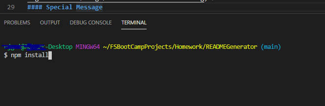
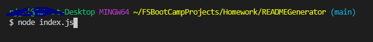
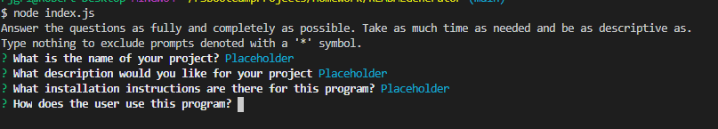

# ReadMe Generator
## Description
A ReadMe.md generator based on user prompts
## Table of Contents
* [Description](#Description)
* [Installation](#Installation)
* [Usage](#Usage)
* [License](#License)

* [Testing](#Testing)
* [Questions](#Questions)
* [Special](#Special)
## Installation
Clone the repo down to your machine using GitBash or Terminal. Once that is done open up an integrated terminal in the same location as `index.js` and type the command: `npm install`.

This will automatically install the necessary packages required to run the program.
## Usage
VIDEO TUTORIAL
[Video Link](https://drive.google.com/file/d/15EAnY7luSVQu6cqf_hMAfFA1uIUlJoQp/preview) 
Once the packages have been installed, in the same terminal type the command `node index.js`, you will then be given a series of prompts to answer.

These answers will be used to generate the ReadMe.md.

### License
MIT License 
### Testing
No external testing needed. This program will attempt to catch errors internally and log them out in the console for further review.
#### Questions?
If you have questions regarding this program: 
Send me a message through GitHub:  
Or through email here: 
#### Special Message
This ReadMe.md was generated using the program itself, and edited later for additional content including the video link and example images.